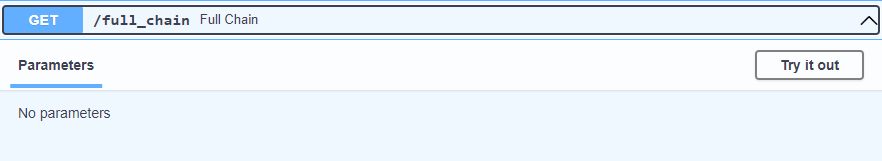
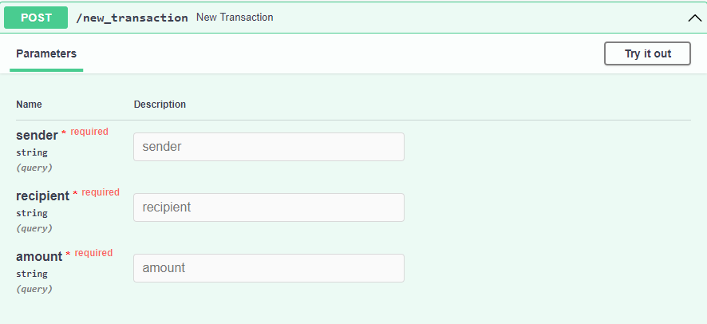

#EE4017 Group 10 Source Code

This project consists of 4 .py file, each representing one single user:  

    blockchain1.py => user1 => 1000
    blockchain2.py => user2 => 2000
    blockchain3.py => user3 => 3000
    blockchain4.py => user4 => 4000
  
To start the project, execute the files desired.  
This will start a local server for corresponding user.  

In this project, we used FASTAPI built-in interface.  

The HTTP server allows direct query for accessing.  
However, navigate the functions through API is suggested. 

To access:  

    http://0.0.0:{port}/docs (for MAC)

    http://127.0.0.1:{port}/docs or
    http://127.0.0.1:{port}/redoc (for Windows)

##API User Guide:

###Step 1: @app method 'full_chain'

@para = None

Click the 'try it out' button, and then hit execute.  

Take blockchain1.py as example:  

    This will create the genisis block as the starting point. 
    As it can be seen in the figure, the chain will list
        - The length of chain
        - The information of each block inside the chain

###Step 2: @app method 'get_pub_key'

@para = None

Click the 'try it out' button, and then hit execute

Take blockchain1.py as example:

    This will retrieve the unique public key from the user,  
    which is generated along with the private key at the beginning.
    The public key will be required in other functions later.

###Step 3: @app method 'get balance'

@para = None

Click the 'try it out' button, and then hit execute

Take blockchain1.py as example:

    Each new user starts with 50 Bitcoins.
    The defition will return the user's wallet balance.

###Step 4: @app method 'mine'

@para = None

Click the 'try it out' button, and then hit execute

Take blockchain1.py as example:

    This is the process of adding new block.
    The new block will contain certain information
        - Index of that block
        - The public key of the miner
        - The reward for mining
        - The hash value of the previous block
        - The hash value of that block

###Step 4: @app method 'new_transaction'

@para = sender, recipient, amount

This definition takes in 3 parameters:
    
    sender => public key of the sender
    recipient => public key of the recipient
    amount => numeric input, either string or decimal

Click the 'try it out' button.

In this example user1, {port=1000} and user3, {port=3000} will be used.

From each's 'get_pub_key' we will get the public keys.

The definition will check the sender's wallet balance. 
If the requested amount is greater than it,
the transaction will be terminated.

    For example, initially the wallet will contain 50 coins.
    An attempt of sending 60 coins will be made.

As response, an error message will be sent,
informing that the balance is not enough.

    
In contrast, this time we will set the amount to be 20.

This time, the transaction will be executed.

###Step 5: @app method 'mine'

@para = None

After a new transaction is made,
'mine' is called to upload the record. 
After executing the 'mine' method, 
the transaction can be seen.
For each transaction, 0.5 coin is taken for fee.

The record can be verified in the 'full_chain'
    and 'get_balance' methods.

###Step 6: @app method 'get_node'

@para = None

Click the 'try it out' button, and then hit execute

This will return the neighbor nodes stored in the table. 
Initially, no node will be contained.

@[empty get node](assets/def_get_node_empty.png)

###Step 7: @app method 'register'

@para = target

This definition takes in 1 parameter:
    
    target => node's ip address 
    For Windows: 127.0.0.1:{port}
    For MAC: 0.0.0:{port}

To store other nodes in the relationship table, 
execute the method.

Message will show the node have been added.

###Step 8: @app method 'get_node'

Execute the definition. 
This time, port 3000 will be shown.

###Step 9: @app method 'consensus'

@para = None

Click the 'try it out' button, and then hit execute.

It will check the validity.

####--Author Alex Yu